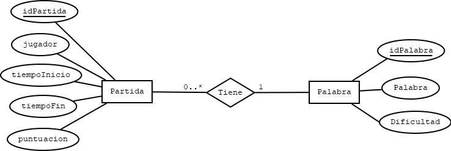

# Producto 2 - Desarrollo del juego Ahorcado con conexión a BBDD y autenticación por medio de LDAP

> En esta parte del proyecto se han realizado los diagramas ER y UML y se ha creado la estructura de las clases utilizando el diseño MVC.

## Tabla de contenidos
* [Información general](#informacion-general)
* [Tecnologías utilizadas](#tecnologias)
* [Diagramas ER y UML y Base de Datos](#diagramas)
* [Estructura de clases](#clases)
* [Resultado final](#resultado)
* [Próximas mejoras](#mejoras)
* [Colaboradores](#colaboradores)

## Información general

El objetivo principal del producto es:

● Realizar un diagrama de clases UML y, a partir de este, un diagrama de
modelo-relacional.

● Crear una base de datos partiendo del diagrama modelo-relacional diseñado
previamente.

● Crear la estructura básica del patrón de diseño MVC y la persistencia de los
datos usando el patrón de diseño DAO.

## Tecnologias y aplicaciones utilizadas

● Los diagramas se han creado y editado por medio de la aplicación DIA.

● Para crear la estructura de las clases se ha utilizado la aplicación Eclipse, desde donde se ha creado un Proyecto Web Dinámico.

## Diagramas

El Diagrama UML está formado por 3 entidades: Usuario o Jugador, Partida y Palabra.

Sin embargo, en la Base de Datos únicamente se han creado las tablas Partida y Palabra, ya que los datos del Jugador los tomaremos del LDAP,
por lo que no hace falta que el usuario esté presente en la BBDD.

En cuanto a las columnas creadas en la BBDD, la tabla Palabra sólo tendrá los atributos: 

- idPalabra: un INT auto-incremental
- Palabra: String
- Dificultad: un INT que nos servirá para que el jugador escoja la dificultad de la palabra que desee resolver.

La tabla Partida tiene los siguientes atributos:

- id (clave primaria y auto incremental)
- tiempoInicio
- tiempoFin
- fallos
- uid: (se guardará automáticamente en la BBDD una vez que tengamos la lógica del juego implementada). Por ahora se han hecho sólo pruebas manuales.
- idPalabra (cláve foránea)
- finPartida: Un booleano que nos indicará si la partida ha finalizado o no.
- puntuación: La puntuación la vamos a calcular según el menor tiempo que ha tardado el jugador en terminar una partida.

Por otro lado, en el diagrama UML salen unos atributos adicionales ya que vamos a tener que declarar la dificultad y un arraylist de letras. Eso será únicamente dentro de nuestra clase y no es necesario agregar estas dos columnas también a la BBDD.

En cuanto al diagrama ER, podemos ver que se ha creado una cardinalidad (0,N) entre Palabra y Partida, ya que 1 palabra puede estar en ninguna o en muchas partidas, mientras que una partida siempre tendrá como mucho una palabra.

## Clases

Para la estructura de clases se ha utilizado el patrón de diseño MVC y la persistencia de datos usando DAO.

Asimismo, hemos recurrido a la librería MySQL Connector y JDBC con el fin de garantizar la conexión a la BBDD.

Por ahora, en el package Controller tenemos dos Servlets: Login y Ahorcado, que son el controlador del sistema de inicio de sesión y el controlador del juego.

En el package Modelo tenemos nuestras clases y listas de palabras y partidas con los correspondientes constructores, getters y setters si es el caso.

En el package DAO están implementados los métodos junto con las consultas para obtener de la BBDD los datos que necesitamos.

Finalmente, en la carpeta WEB-INF se han agregado los ficheros JSP.

## Resultado actual

Este sería el resultado de lo que se ha desarrollado hasta ahora:

- Si el usuario se encuentra presente en el LDAP, se le presentará una página de bienvenida con una tabla donde aparecen las cinco mejores puntuaciones.

- Asimismo, se le informa de cuál es su mejor puntuación y se le da la posibilidad de iniciar una nueva partida seleccionando la dificultad.

- Si el usuario no tuviera ninguna partida jugada, se le diría que "todavía no ha jugado ninguna partida".

- Si el usuario que intenta iniciar sesión no existe en el LDAP, entonces directamente sería redirigido a la página Failure.jsp.

Por ahora las puntuaciones fueron agregadas manualmente a la BBDD con fines de testing, pero una vez realizada la programación del juego se realizará un commit a la BBDD con la puntuación del usuario.

## Próximas mejoras
El proyecto se encuentra en fase de desarrollo, por lo que aún faltan mejoras como:

- Implementación JPA
- Implementación lógica del juego
- Limpieza de comentarios y códigos innecesarios

## Colaboradores
Creado por Bucatariu Elvis, Elena Peris Mercé, Victor Fuentes Noguera, Alain Rovira Luque

